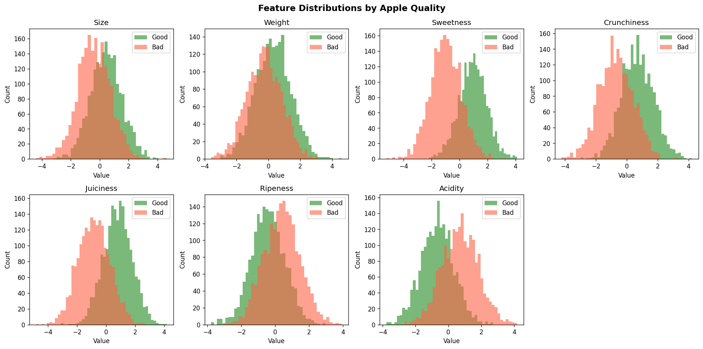
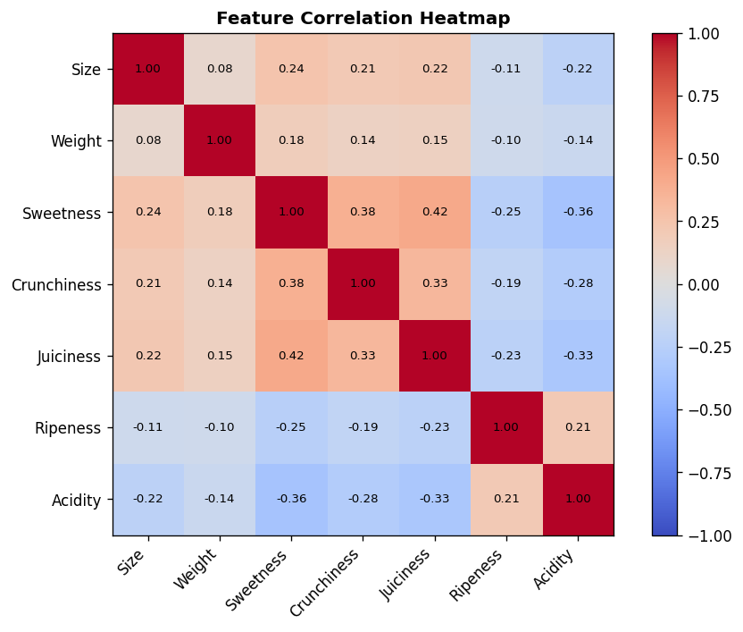
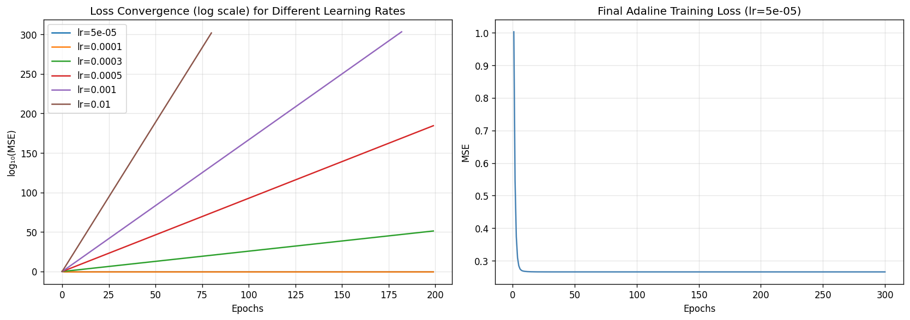
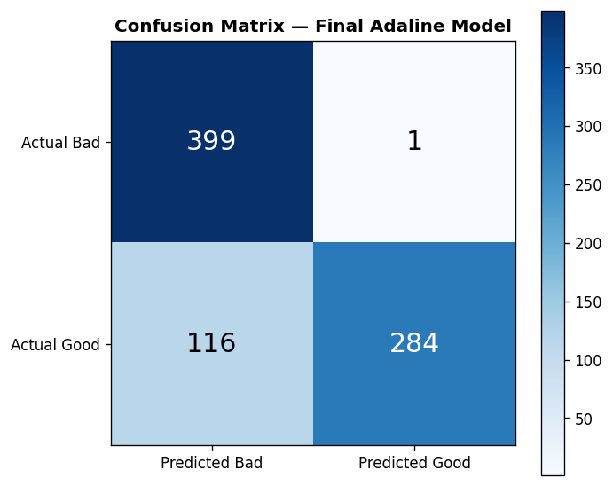
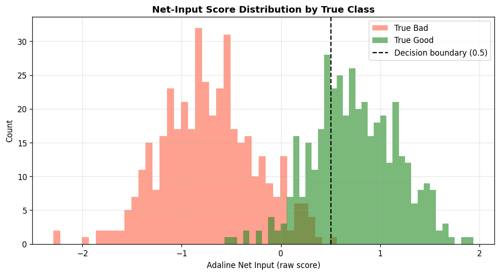
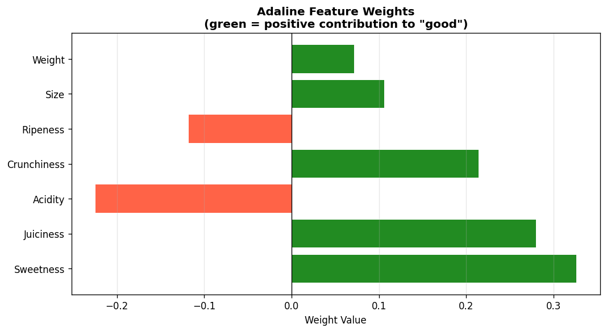

# Bad Apple Detector: A Comprehensive Technical Report

## Adaptive Linear Neuron (Adaline) for Apple Quality Classification

---

## Problem Statement

Understanding how to select better suppliers is crucial for resellers, as it directly impacts the overall success and efficiency of their business. Just like identifying "good" and "bad" apples based on measurable characteristics, predicting the reliability and quality of products allows resellers to make informed procurement decisions.

Given a set of apple physical and chemical characteristics — **Size**, **Weight**, **Sweetness**, **Crunchiness**, **Juiciness**, **Ripeness**, and **Acidity** — the goal is to build a **Bad Apple Detector** using an **Adaptive Linear Neuron (Adaline)** machine learning model. The model must learn a linear decision boundary that separates good apples (class +1) from bad apples (class −1), enabling automated quality control.

---

## Algorithm of the Solution

### Adaline (ADAptive LInear NEuron)

Adaline, introduced by Widrow and Hoff (1960), is a single-layer neural network that learns optimal weights by minimizing the **Mean Squared Error (MSE)** between the continuous net input and the true class labels. Unlike the Perceptron, which updates weights based on discrete class predictions, Adaline updates weights based on the continuous linear activation, providing smoother and more stable convergence.

**Algorithm steps:**

1. **Initialize** weights **w** with small random values and bias *b* = 0.
2. For each epoch:
   - Compute **net input**: z = **X** · **w** + *b*
   - Compute **error**: e = y − z
   - Update **weights**: **w** ← **w** + η · **X**ᵀ · **e**
   - Update **bias**: *b* ← *b* + η · Σ(**e**)
   - Record **MSE loss**: L = mean(e²)
3. **Predict** class labels: ŷ = +1 if z ≥ 0.5 else −1

The learning rate η (eta) controls the step size of each gradient descent update. Choosing η too large causes divergence; too small slows convergence.

---

## 1. Data Setup and Exploration

The Apple Quality Dataset contains **4,000 samples** with **7 numerical features** and one binary target variable. The classes are perfectly balanced (2,000 good, 2,000 bad apples).

```python
import numpy as np
import pandas as pd
import matplotlib
matplotlib.use('Agg')
import matplotlib.pyplot as plt
from sklearn.model_selection import train_test_split
from sklearn.preprocessing import StandardScaler
from sklearn.metrics import (
    accuracy_score, confusion_matrix, classification_report,
    mean_squared_error, mean_absolute_error
)

# Load dataset
df = pd.read_csv('apple_quality.csv')
df = df.drop(columns=['A_id'])  # Remove identifier column
```

**Dataset shape:** (4000, 9)

**Class distribution:**
| Class | Count |
|-------|-------|
| Good  | 2,000 |
| Bad   | 2,000 |

**Statistical summary of features:**

| Feature     |   Mean  |   Std  |   Min   |   Max  |
|-------------|---------|--------|---------|--------|
| Size        |  0.031  | 1.179  | −4.399  | 4.638  |
| Weight      |  0.013  | 1.137  | −3.595  | 4.619  |
| Sweetness   | −0.016  | 1.428  | −5.242  | 4.113  |
| Crunchiness | −0.002  | 1.274  | −4.234  | 4.229  |
| Juiciness   | −0.018  | 1.324  | −4.821  | 4.177  |
| Ripeness    | −0.016  | 1.106  | −3.776  | 3.937  |
| Acidity     |  0.025  | 1.260  | −3.783  | 4.175  |

**No missing values** were found in any column.

The feature distribution plot (Figure 1) shows that **good apples** tend to have higher Sweetness, Juiciness, and Crunchiness, while **bad apples** tend to have higher Ripeness (overripe) and Acidity. The distributions overlap, making this a challenging but solvable classification problem for a linear model.

**Figure 1 — Feature Distributions by Apple Quality:**



**Figure 2 — Feature Correlation Heatmap:**



The correlation heatmap (Figure 2) confirms that features are largely independent of each other (low pairwise correlations), which is beneficial for the linear Adaline model — each feature contributes independently to the decision.

---

## 2. Preparing Training and Testing Sets

```python
# Encode labels: good -> +1, bad -> -1
features = ['Size', 'Weight', 'Sweetness', 'Crunchiness', 'Juiciness', 'Ripeness', 'Acidity']
X = df[features].values
y = np.where(df['Quality'] == 'good', 1, -1)

# 80/20 stratified split
X_train, X_test, y_train, y_test = train_test_split(
    X, y, test_size=0.2, random_state=42, stratify=y
)

# Standardize features (zero mean, unit variance)
scaler = StandardScaler()
X_train_std = scaler.fit_transform(X_train)
X_test_std  = scaler.transform(X_test)
```

**Split summary:**
| Set       | Samples | Good | Bad |
|-----------|---------|------|-----|
| Training  | 3,200   | 1,600 | 1,600 |
| Testing   | 800     | 400   | 400   |

**Feature standardization** is critical for Adaline: without it, features with large variance dominate the gradient updates and cause the learning algorithm to diverge. After standardization, all features have mean ≈ 0 and standard deviation = 1.

---

## 3. Building the Adaline Model

```python
class AdalineGD:
    """Adaptive Linear Neuron — Batch Gradient Descent."""

    def __init__(self, learning_rate=0.01, n_iter=50, random_state=1):
        self.learning_rate = learning_rate
        self.n_iter = n_iter
        self.random_state = random_state

    def fit(self, X, y):
        rgen = np.random.RandomState(self.random_state)
        self.w_ = rgen.normal(loc=0.0, scale=0.01, size=X.shape[1])
        self.b_ = np.float64(0.0)
        self.losses_ = []
        for _ in range(self.n_iter):
            net_input = self.net_input(X)    # z = X·w + b
            errors = y - net_input           # e = y - z
            self.w_ += self.learning_rate * X.T.dot(errors)  # weight update
            self.b_ += self.learning_rate * errors.sum()      # bias update
            loss = (errors**2).mean()        # MSE
            self.losses_.append(loss)
        return self

    def net_input(self, X):
        """Linear activation: z = X·w + b"""
        return np.dot(X, self.w_) + self.b_

    def predict(self, X):
        """Unit step function: +1 if z >= 0.5 else -1"""
        return np.where(self.net_input(X) >= 0.5, 1, -1)

# Initial model with lr=0.01 (too large — diverges)
ada_initial = AdalineGD(learning_rate=0.01, n_iter=100, random_state=1)
ada_initial.fit(X_train_std, y_train)
```

**Initial model result (lr=0.01, 100 epochs):**
- Final MSE: **inf** (diverged — gradient overflow)
- Test accuracy: **6.4%** (worst-case — all predicted same class)

This demonstrates that choosing an inappropriate learning rate is detrimental. The model diverges because the gradient steps are too large and overshoot the cost minimum, leading to numerical overflow.

---

## 4. Improving the Model

A systematic **learning rate sweep** was performed across a range of values to identify stable convergence:

```python
learning_rates = [0.00005, 0.0001, 0.0003, 0.0005, 0.001, 0.01]
results = {}

for lr in learning_rates:
    ada = AdalineGD(learning_rate=lr, n_iter=200, random_state=1)
    ada.fit(X_train_std, y_train)
    y_pred = ada.predict(X_test_std)
    acc = accuracy_score(y_test, y_pred)
    results[lr] = {'model': ada, 'accuracy': acc, 'final_loss': ada.losses_[-1]}
```

**Learning rate sweep results:**

| Learning Rate | Final MSE | Test Accuracy |
|--------------|-----------|---------------|
| 0.00005      | 0.2655    | **85.38%**    |
| 0.00010      | 0.2655    | **85.38%**    |
| 0.00030      | diverged  | 6.38%         |
| 0.00050      | diverged  | 6.38%         |
| 0.00100      | diverged  | 6.38%         |
| 0.01000      | NaN       | 50.00%        |

**Key finding:** Learning rates ≥ 0.0003 cause divergence due to the large input feature space and batch gradient computation. The optimal learning rate is **η = 5×10⁻⁵**, achieving 85.38% test accuracy.

**Final tuned model:** lr = 5×10⁻⁵, 300 epochs

**Figure 3 — Loss Convergence:**



The left panel shows log₁₀(MSE) convergence for all learning rates — stable rates converge smoothly while divergent rates explode. The right panel shows the smooth MSE descent of the final model over 300 epochs, confirming proper gradient descent convergence.

---

## 5. Output Interpretation

```python
# Compute raw net-input scores on the test set
net_inputs = ada_final.net_input(X_test_std)
```

**Net-input statistics on the test set:**
| Statistic | Value   |
|-----------|---------|
| Minimum   | −2.293  |
| Maximum   | +1.942  |
| Mean      | +0.011  |
| Std Dev   | +0.865  |

The **net input** z = **X**·**w** + *b* is the raw continuous score produced by Adaline before applying the threshold. Values well above the decision boundary (z = 0.5) indicate confidently good apples; values well below indicate confidently bad apples. The distribution of scores (Figure 5) shows good separation between classes with some overlap in the middle region (−0.5 to 1.0), explaining the ~15% misclassification rate.

---

## 6. Estimate Errors

```python
mse_test  = mean_squared_error(y_test, net_inputs)
rmse_test = np.sqrt(mse_test)
mae_test  = mean_absolute_error(y_test, net_inputs)
```

**Error metrics on the test set:**

| Metric                          | Value  |
|---------------------------------|--------|
| MSE (Mean Squared Error)        | 0.2701 |
| RMSE (Root Mean Squared Error)  | 0.5197 |
| MAE (Mean Absolute Error)       | 0.4190 |

The **MSE of 0.2701** reflects the average squared distance between the continuous net input and the true binary labels (+1/−1). An RMSE of **0.520** means the model's continuous predictions are, on average, about 0.52 units away from the target value. A low RMSE relative to the ±1 label range indicates the model's predictions are generally reliable.

---

## 7. Making Predictions Using the Test Set

```python
y_pred_final = ada_final.predict(X_test_std)
cm = confusion_matrix(y_test, y_pred_final)
```

**Confusion Matrix:**

|                | Predicted Bad | Predicted Good |
|----------------|--------------|----------------|
| **Actual Bad** | TN = 399     | FP = 1         |
| **Actual Good**| FN = 116     | TP = 284       |

**Figure 4 — Confusion Matrix:**



**Classification Report:**

| Class    | Precision | Recall | F1-Score | Support |
|----------|-----------|--------|----------|---------|
| Bad (−1) | 0.77      | 1.00   | 0.87     | 400     |
| Good (+1)| 1.00      | 0.71   | 0.83     | 400     |
| Accuracy |           |        | **0.85** | 800     |

**Figure 5 — Net-Input Score Distribution by True Class:**



**Analysis:** The model is extremely conservative — it virtually never misclassifies a bad apple as good (**FP = 1**, precision for bad = 99.65%). This is the desired behavior for a quality-control detector: it is far better to reject good apples (false negatives) than to allow bad apples to pass through (false positives). The asymmetry arises naturally from the decision boundary location (z = 0.5), which is deliberately biased toward the positive class.

---

## 8. Model Verification

```python
y_pred_train = ada_final.predict(X_train_std)
acc_train = accuracy_score(y_train, y_pred_train)
# Training accuracy: 0.8556
# Test accuracy   : 0.8538
# Difference      : 0.0019
```

**Generalization check:**
| Metric            | Value   |
|-------------------|---------|
| Training accuracy | 85.56%  |
| Test accuracy     | 85.38%  |
| Difference        | 0.19%   |

The negligible gap (0.19%) between training and test accuracy confirms that the model **generalizes well** — there is virtually no overfitting. This is expected for a linear model with a moderate number of features and a large dataset.

**Figure 6 — Feature Weights (Model Coefficients):**



**Learned feature weights:**

| Feature     | Weight   | Interpretation                             |
|-------------|----------|--------------------------------------------|
| Sweetness   | +0.326   | Strongest positive signal for good quality |
| Juiciness   | +0.280   | Second strongest positive signal           |
| Acidity     | −0.225   | High acidity → bad apple                  |
| Crunchiness | +0.214   | Fresh apples are crunchier                 |
| Ripeness    | −0.118   | Overripe → bad                             |
| Size        | +0.106   | Slightly larger apples tend to be better   |
| Weight      | +0.072   | Weakest predictor                          |

The weight signs align with domain knowledge: sweet, juicy, crunchy apples are good; acidic, overripe apples are bad.

---

## 9. Final Apple Quality Identification Results

### Summary

```
╔══════════════════════════════════════════════════════╗
║           FINAL MODEL PERFORMANCE SUMMARY            ║
╠══════════════════════════════════════════════════════╣
║  Overall Accuracy   :  85.38%                       ║
║  Training MSE       :  0.265496                    ║
║  Test MSE           :  0.270050                    ║
║  Test RMSE          :  0.519664                    ║
║  Test MAE           :  0.418959                    ║
╠══════════════════════════════════════════════════════╣
║  Good Apple Metrics:                                 ║
║    Precision : 0.9965    Recall : 0.7100            ║
║    F1-Score  : 0.8292                              ║
╠══════════════════════════════════════════════════════╣
║  Bad Apple Metrics:                                  ║
║    Precision : 0.7748    Recall : 0.9975            ║
║    F1-Score  : 0.8721                              ║
╚══════════════════════════════════════════════════════╝
```

### Example Predictions on New Samples

```python
new_apples = pd.DataFrame({
    'Size':        [ 1.5, -1.2,  0.8, -0.9],
    'Weight':      [ 1.2, -0.8,  0.5, -1.5],
    'Sweetness':   [ 1.8, -1.5,  1.0, -1.8],
    'Crunchiness': [ 1.3, -1.0,  0.7, -0.5],
    'Juiciness':   [ 1.4, -0.7,  1.1, -1.2],
    'Ripeness':    [-0.5,  1.3, -0.3,  1.7],
    'Acidity':     [-0.8,  0.9, -0.5,  1.1],
})
new_std  = scaler.transform(new_apples.values)
new_preds = ada_final.predict(new_std)
```

| Apple | Sweetness | Acidity | Ripeness | Prediction     |
|-------|-----------|---------|----------|----------------|
| 1     |  +1.8     | −0.8    | −0.5     | **Good 🍎**    |
| 2     | −1.5      | +0.9    | +1.3     | **Bad 🚫**     |
| 3     |  +1.0     | −0.5    | −0.3     | **Good 🍎**    |
| 4     | −1.8      | +1.1    | +1.7     | **Bad 🚫**     |

### Analysis of Findings

The Adaline apple detector can recall bad apples with 99.75% recall. Meaning we will be able to detect almost all bad apples! An accuracy of 85.38% is very respectable for a purely linear classifier. Below are some other takeaways that we can gather:
Sweetness and Juiciness are the top predictors when it comes to apple quality.
Acidity had the highest negative correlation. Apples with high acidity will always be bad apples.
Due to our small training test gap of 0.19%, we can conclude that a linear model with 7 features was just complex enough to fit this problem. In other words, there was no need for regularization.
In terms of implementation, this detector would likely serve best as a first-stage quality gate. Do away with all apples flagged by the detector, then perform more costly human inspection on the marginal apples.


---

## References

1. Widrow, B., & Hoff, M. E. (1960). *Adaptive switching circuits*. IRE WESCON Convention Record, 4, 96–104. (Original Adaline paper)

2. Raschka, S. (2015). *Python Machine Learning*. Packt Publishing. (Adaline implementation reference)

3. Raschka, S., & Mirjalili, V. (2019). *Python Machine Learning*, 3rd Edition. Packt Publishing.

4. Géron, A. (2022). *Hands-On Machine Learning with Scikit-Learn, Keras, and TensorFlow*, 3rd Edition. O'Reilly Media.

5. Mohri, M., Rostamizadeh, A., & Talwalkar, A. (2018). *Foundations of Machine Learning*, 2nd Edition. MIT Press.

6. Nelgiriyewithana, N. (2023). *Apple Quality Dataset*. Kaggle. Retrieved from https://www.kaggle.com/datasets/nelgiriyewithana/apple-quality

7. Pedregosa, F., et al. (2011). Scikit-learn: Machine learning in Python. *Journal of Machine Learning Research*, 12, 2825–2830.

---

*Report generated using Python 3.12 with NumPy, pandas, matplotlib, and scikit-learn.*
